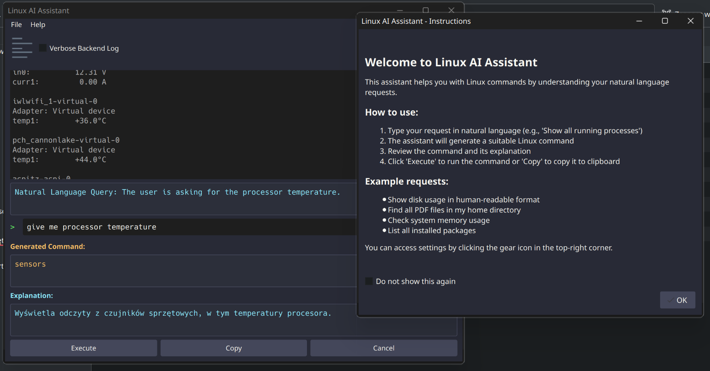

    
# Linux AI Assistant (GUI & CLI)

A versatile AI-powered assistant to help you generate, understand, and execute Linux commands using natural language. This project provides both a Graphical User Interface (GUI) and a Command-Line Interface (CLI), both utilizing Google Gemini.

[](https://www.buymeacoffee.com/krzyzu.83)

Find the project on GitHub: [hyconiek/linux_ai_terminal_assistant](https://github.com/hyconiek/linux_ai_terminal_assistant)

## 🎉 Latest Release: v1.1 - Offline Mode, Internationalization & More! 🎉

The easiest way to try the **Linux AI Assistant GUI** is by downloading our latest AppImage or standalone executable release! AppImages are portable and should run on most modern Linux distributions without installation.

➡️ **[Download the latest v1.1 release from GitHub](https://github.com/hyconiek/linux_ai_terminal_assistant/releases/latest)** ⬅️

### What's New in v1.1:
 *   **Full Offline Mode:** The assistant now detects internet outages and switches to a functional offline mode, using an extensive built-in cache for command explanations.
 *   **Automatic Language Adaptation:** The AI is automatically instructed to respond in your system's native language (supports Polish, Czech, German, Spanish, and many more), making interactions more natural.
 *   **Secure Sudo Password Handling:** The GUI now provides a secure dialog to enter your `sudo` password for commands that require administrator privileges.
 *   **Interactive AI Clarification:** If a query is ambiguous, the application will pop up a dialog with clarifying questions from the AI to help you refine your request.
 *   **Advanced AI Optimization Settings:** A new menu allows you to toggle real-time analysis and AI caching to manage API costs, and even import/export the explanation cache.
 *   **Wayland Integration Fix:** The bug preventing the app icon from grouping correctly on modern Wayland desktops has been resolved.

### How to Run:

#### AppImage:
1.  **Download** the `Linux-AI-Assistant-x86_64.AppImage` file.
2.  **Make it executable**: `chmod +x Linux-AI-Assistant-x86_64.AppImage`
3.  **Run**: `./Linux-AI-Assistant-x86_64.AppImage`

#### Standalone Executable (PyInstaller onefile):
1.  **Download** the `Linux-AI-Assistant-onefile` executable.
2.  **Make it executable**: `chmod +x Linux-AI-Assistant-onefile`
3.  **Run**: `./Linux-AI-Assistant-onefile`

### First Time Setup:
*   **API Key**: On the first launch, if a Gemini API key is not configured, you will be prompted to enter one. You can get a key from [Google AI Studio](https://aistudio.google.com/).
*   Manage your API key and other settings via "Settings" (File > Settings or the gear icon).

### AppImage Notes:
*   **Desktop Integration**: For menu icons and easy command-line access, it's recommended to use the provided `install.sh` script (requires sudo).
*   **Requirements**: 64-bit Linux (glibc 2.35+ recommended), `fuse` package might be needed for AppImage (`sudo apt install fuse`).


## Core Features

- **Intuitive GUI/CLI**: Choose your preferred way to interact.
- **Natural Language to Command**: Ask for commands in plain English (powered by Google Gemini).
- **Multi-language AI Responses**: AI adapts to your system's language for more natural interaction.
- **Offline Mode with Pre-filled Cache**: Core functionality remains available without an internet connection.
- **Secure Sudo Password Handling**: (GUI) A secure dialog for entering administrator passwords.
- **AI Clarification Dialogs**: (GUI) The app prompts for more details when your request is ambiguous.
- **Direct Command Execution**: (GUI) Run generated commands directly or in an external terminal.
- **Advanced AI Optimization Settings**: (GUI) Control API usage with toggles for real-time analysis and caching.
- **API Key Management**: (GUI) Securely store and manage your Google Gemini API key.
- **Customizable Themes**: (GUI) Supports Dark (default) and Light modes.
- **Command History**: (GUI) Navigate input history with arrow keys.

## How to Get a Gemini API Key

1.  Visit [Google AI Studio](https://aistudio.google.com/).
2.  Sign in with your Google account.
3.  Navigate to "API keys" in the left sidebar.
4.  Click "Create API key" and copy the generated key.

## Using the Command-Line Interface (CLI)

The core logic is also available as a CLI tool (`src/backend_cli.py`), used by the GUI.

### Prerequisites (CLI)

- Python 3.7+ (Python 3.11+ recommended).
- An active Google Gemini API Key.

### Setup (CLI)

1.  **Clone the repository:**
    ```bash
    git clone https://github.com/hyconiek/linux_ai_terminal_assistant.git
    cd linux_ai_terminal_assistant
    ```

2.  **Create and activate a virtual environment (recommended):**
    ```bash
    python3 -m venv venv
    source venv/bin/activate
    ```

3.  **Install dependencies:**
    ```bash
    pip install -r requirements.txt
    ```

4.  **Set API Key (CLI):**
    The CLI backend expects the `GOOGLE_API_KEY` environment variable.
    ```bash
    export GOOGLE_API_KEY="YOUR_GEMINI_API_KEY"
    ```
    For permanent setting, add this to your shell's configuration file (e.g., `.bashrc`, `.zshrc`).

### CLI Usage Examples

*(Run from the root directory of the cloned repository)*

```bash
# Interactive mode for command generation
python3 src/backend_cli.py

# For a specific query (JSON output used by GUI)
python3 src/backend_cli.py --query "are there any text files here?" --json --working-dir "/path/to/your/directory"

  

Building the GUI Application from Source

If you want to build the GUI application yourself:
Prerequisites (Building GUI)

    All prerequisites for CLI.

    PyQt5: PyQt5>=5.15.0

    PyInstaller: pip install pyinstaller

Build Steps

    Ensure your project is set up and dependencies are installed in your virtual environment.

    Navigate to the project's root directory.

    Run PyInstaller. For a one-file executable:
    code Bash

    IGNORE_WHEN_COPYING_START
    IGNORE_WHEN_COPYING_END

        
    pyinstaller --name "Linux-AI-Assistant-onefile" \
                --onefile \
                --windowed \
                --add-data "laia_icon.png:." \
                --add-data "src:src" \
                # ... add other hidden imports as needed
                linux_ai_assistant_gui.py

      

    The executable will be in the dist folder.

License

This project is created by Krzysztof Żuchowski.
Copyright © 2025 Krzysztof Żuchowski. All rights reserved.

Licensed under the MIT License.

Made with ❤️ and Python
