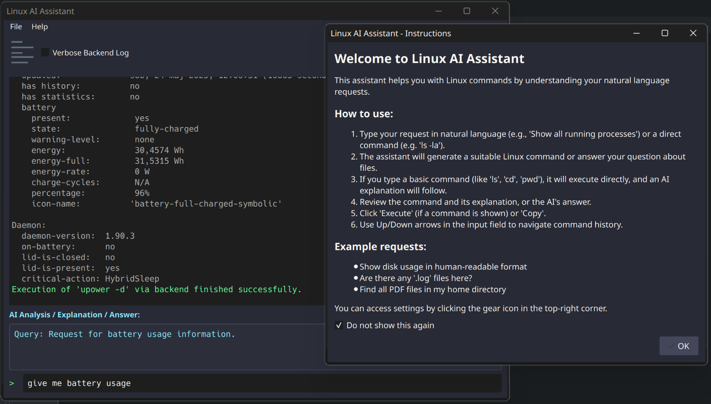

      
# Linux AI Assistant (GUI & CLI)

A versatile AI-powered assistant to help you generate, understand, and execute Linux commands using natural language. This project provides both a Graphical User Interface (GUI) and a Command-Line Interface (CLI), both utilizing Google Gemini.

[](https://www.buymeacoffee.com/krzyzu.83)

Find the project on GitHub: [hyconiek/linux_ai_terminal_assistant](https://github.com/hyconiek/linux_ai_terminal_assistant)

## 🎉 Latest Release: v1.0.4 - Enhanced Context and Interaction! 🎉

The easiest way to try the **Linux AI Assistant GUI** is by downloading our latest AppImage or standalone executable release! AppImages are portable and should run on most modern Linux distributions without installation.

➡️ **[Download `Linux-AI-Assistant-x86_64.AppImage` or the `Linux-AI-Assistant-onefile` executable from Releases (v1.0.4)](https://github.com/hyconiek/linux_ai_terminal_assistant/releases/latest)** ⬅️

### What's New in v1.0.4:
*   **Contextual Awareness of CWD:** The AI now receives a list of files and directories from your current working directory (CWD) to provide more relevant command suggestions and answer questions about your CWD content.
*   **AI-Powered File Search:** If you ask about files not immediately visible in the initial CWD listing, the AI can request the backend to perform a quick search (`find . -maxdepth 2 ...`) in the CWD and its immediate subdirectories. Results are then fed back to the AI for a more informed response or command.
*   **Smarter Interaction Suggestions:** The AI can now suggest specific button labels for the GUI if a command is expected to be interactive (e.g., "Install (confirm Y)"). If such an interaction is suggested, the GUI will offer to run the command in an external terminal for direct user input.
*   **Textual Answers for CWD Questions:** Ask the AI "Are there any snap-related files here?" and it can now respond textually based on the CWD file list, instead of only generating commands.
*   **Improved Contextual Follow-up:** After discussing files in your CWD, you can refer to them more naturally in subsequent commands (e.g., "rename that snap file").

### How to Run:

#### AppImage:
1.  **Download** the `Linux-AI-Assistant-x86_64.AppImage` file.
2.  **Make it executable**: `chmod +x Linux-AI-Assistant-x86_64.AppImage`
3.  **Run**: `./Linux-AI-Assistant-x86_64.AppImage`
    *(Some desktop environments might also allow you to run it by double-clicking.)*

#### Standalone Executable (PyInstaller onefile):
1.  **Download** the `Linux-AI-Assistant-onefile` (or similar named) executable.
2.  **Make it executable**: `chmod +x Linux-AI-Assistant-onefile`
3.  **Run**: `./Linux-AI-Assistant-onefile`

### First Time Setup:
*   **API Key**: On the first launch, if a Gemini API key is not configured, you will be prompted to enter one. You can get a key from [Google AI Studio](https://aistudio.google.com/).
*   Manage your API key and other settings via "Settings" (File > Settings or the gear icon).

### AppImage Notes:
*   **Size**: AppImage bundles Python and necessary libraries. Size may vary per release.
*   **Desktop Integration**: For menu icons, consider "AppImageLauncher" or manually creating a `.desktop` file.
*   **Requirements**: 64-bit Linux (glibc 2.35+ recommended), `fuse` package might be needed for AppImage (`sudo apt install fuse`).

## Core Features

- **Intuitive GUI/CLI**: Choose your preferred way to interact.
- **Natural Language to Command**: Ask for commands in plain English (powered by Google Gemini).
- **AI-Powered**: Utilizes Google Gemini for command suggestions, explanations, and CWD content analysis.
- **Direct Command Execution**: (GUI) Run generated commands directly or in an external terminal for interactive ones.
- **Copy to Clipboard**: (GUI) Easily copy commands or AI's textual answers.
- **API Key Management**: (GUI) Securely store and manage your Google Gemini API key.
- **Customizable Themes**: (GUI) Supports Dark (default) and Light modes.
- **Verbose Logging Toggle**: (GUI) Control the amount of system/debug information displayed.
- **Cross-Platform Potential**: Built with Python and PyQt5.

## How to Get a Gemini API Key

1.  Visit [Google AI Studio](https://aistudio.google.com/).
2.  Sign in with your Google account.
3.  Navigate to "API keys" in the left sidebar.
4.  Click "Create API key" and copy the generated key.

## Using the Command-Line Interface (CLI)

The core logic is also available as a CLI tool (`src/backend_cli.py`), used by the GUI.

### Prerequisites (CLI)

- Python 3.7+ (Python 3.11+ recommended).
- An active Google Gemini API Key.

### Setup (CLI)

1.  **Clone the repository:**
    ```bash
    git clone https://github.com/hyconiek/linux_ai_terminal_assistant.git
    cd linux_ai_terminal_assistant
    ```

2.  **Create and activate a virtual environment (recommended):**
    ```bash
    python3 -m venv venv
    source venv/bin/activate  # On Windows: venv\Scripts\activate
    ```

3.  **Install dependencies:**
    (Ensure `requirements.txt` is up-to-date with `google-generativeai` and `PyQt5` if running GUI from source)
    ```bash
    pip install -r requirements.txt
    ```

4.  **Set API Key (CLI):**
    The CLI backend expects the `GOOGLE_API_KEY` environment variable.
    ```bash
    export GOOGLE_API_KEY="YOUR_GEMINI_API_KEY"
    ```
    For permanent setting, add this to your shell's configuration file (e.g., `.bashrc`, `.zshrc`).

### CLI Usage Examples

*(Run from the root directory of the cloned repository)*

```bash
# Backend CLI for command generation/textual answers (interactive mode)
python3 src/backend_cli.py

# For specific query (JSON output used by GUI)
python3 src/backend_cli.py --query "are there any text files here?" --json --working-dir "/path/to/your/directory"

    

IGNORE_WHEN_COPYING_START
Use code with caution. Markdown
IGNORE_WHEN_COPYING_END
Building the GUI Application from Source

If you want to build the GUI application yourself:
Prerequisites (Building GUI)

    All prerequisites for CLI.

    PyQt5: PyQt5>=5.15.0

    PyInstaller: pip install pyinstaller

Build Steps

    Ensure your project is set up and dependencies are installed in your virtual environment.

    Navigate to the project's root directory.

    Run PyInstaller. For a one-file executable:

          
    pyinstaller --name "Linux-AI-Assistant-onefile" \
                --onefile \
                --windowed \
                --add-data "app_icon.png:." \
                --add-data "src:src" \
                --hidden-import="google.generativeai" \
                --hidden-import="google.ai.generativelanguage" \
                --hidden-import="google.auth" \
                --hidden-import="google.api_core" \
                --hidden-import="google.protobuf" \
                --hidden-import="google.type" \
                --hidden-import="google.rpc" \
                --hidden-import="google.longrunning" \
                --hidden-import="google.iam" \
                --hidden-import="google.oauth2" \
                --hidden-import="proto" \
                --hidden-import="grpc" \
                --hidden-import="PIL" \
                --hidden-import="pkg_resources" \
                --hidden-import="pkg_resources.py2_warn" \
                --hidden-import="argparse" \
                --hidden-import="backend_cli" \
                linux_ai_assistant_gui.py

        

    IGNORE_WHEN_COPYING_START

    Use code with caution. Bash
    IGNORE_WHEN_COPYING_END

    The executable will be in the dist folder (e.g., dist/Linux-AI-Assistant-onefile).
    (For AppImage creation, a more complex process involving linuxdeployqt is typically used, often within a Docker container or a Colab notebook configured for AppImage building.)

License

This project is created by Krzysztof Żuchowski.
Copyright © 2025 Krzysztof Żuchowski. All rights reserved.

Licensed under the MIT License.

Made with ❤️ and Python.
